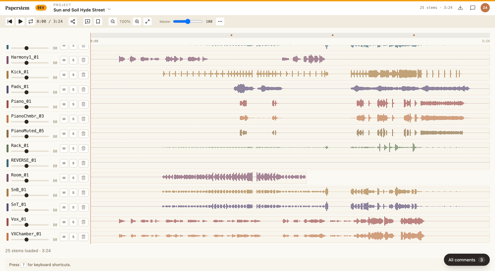

# Paperstem

A DAW-style stem player for sharing rough mixes with bandmates.

**Production:** https://paperstem.fly.dev (login required)
**Staging:** https://paperstem-dev.fly.dev (auto-deployed from `main`)

<!-- TODO: replace with a real screenshot once captured locally. -->


## UI

A Google-Docs-style shell: an `AppHeader` (brand · ▦ projects · project title · 💬 comments · avatar), a flat `AppToolbar` (transport · download · waveform-scale · annotation-create · marker visibility · master volume · time), and the song timeline below. The project list lives behind `⌘K` / the ▦ button as a `ProjectPicker` overlay rather than a persistent sidebar; comments open in a right-side push column.

## Architecture

- **Frontend**: Vite + React + TypeScript + WaveSurfer (`src/client/`)
- **Backend**: Hono on Node, SQLite (`src/server/`); DB path is `./dev.sqlite` by default, overridable via `DATABASE_PATH`
- **Audio**: stems live on the local filesystem under `$PAPERSTEM_AUDIO_ROOT` (a Fly volume in production, `./audio-dev` in dev); the server streams them via a Range-supported `/api/audio/:id` proxy
- **Auth**: magic link via Gmail SMTP, `__Host-` session cookie, 30-day expiry; sessions are DB-backed so they survive restarts
- **Backups**: daily per-project annotation snapshot, weekly per-band SQLite dump (8-week retention) — both on the Fly volume
- **Hosting**: two always-on Fly.io machines in `sjc` (`paperstem` for prod, `paperstem-dev` for staging), ~$3/mo each

## Local development

```bash
npm run dev
```

That's it. The launcher (`bin/dev.ts`) picks two free ports from the OS, wires them through env, and spawns both the API server and Vite. Each invocation gets fresh random ports, so multiple worktrees can run side-by-side. The first lines of output are:

```
  paperstem dev
    UI:  http://localhost:58679
    API: http://localhost:58678
    Dev login (dev@paperstem.local): http://localhost:58679/api/auth/dev-login
```

Open the UI URL. By default the client auto-follows the dev-login URL on first load, so you're logged in as `dev@paperstem.local` with no magic link, no `add-user` step, no manual curl. To log in as someone else, set `PAPERSTEM_DEV_AUTO_LOGIN=other@example.com`; to disable, set it to empty.

`scripts/with-secrets.sh` runs in front of the launcher and pulls `GMAIL_*` from macOS Keychain so secrets never live in env files or shell history. Placeholder values work fine unless you actually need to send a magic link.

`npm run dev:client` and `npm run dev:server` are available for running one process in isolation.

### Sharing state across worktrees

A worktree uses its own empty `./dev.sqlite` by default. Point at the main checkout's DB to share users/sessions/projects:

```bash
DATABASE_PATH=/path/to/main/paperstem/dev.sqlite npm run dev
```

## Verifying changes

- `npx vitest run` — full unit suite, ~3s
- `npx tsc --noEmit` — typecheck
- `npm run test:e2e` — Playwright journeys (spawns the dev server, drives Chromium, ~30s); required for cross-component UI changes, recommended for anything touching playback timing, zoom, or modals

See [docs/testing.md](docs/testing.md) for how to add a new test in the right harness.

A pre-push hook at `scripts/git-hooks/pre-push` runs `npm run build` and `vitest` before any push and blocks if either fails (matches CI). It also refuses direct pushes to `main`. New checkouts must opt in once:

```bash
git config core.hooksPath scripts/git-hooks
```

## Production tooling

```bash
# Onboard a band (creates DB rows, optionally sends invite mails)
flyctl ssh console --app paperstem --command 'node /app/dist/server/bin/onboard-band.js --name "..." --owner-email "..." --member-emails "..."'

# Manually trigger backup or snapshot job (mostly for verification)
flyctl ssh console --app paperstem --command 'node /app/dist/server/bin/run-job.js [snapshots|backups]'
```

## Importing from a multitrack recorder

Paperstem ships a CLI importer that pulls recordings off an SD card and turns them into projects automatically. Currently supports the Tascam Model 12; other multitrack recorders can be added as plugins under [src/server/import/](src/server/import/).

### Workflow

On the device:

1. Once per project, create a new song on the Model 12 and start recording.
2. (Optional) Tap **MARK** at the start of each new idea you want as a separate project in Paperstem.
3. Press **STOP** when done.

On your laptop:

1. Insert the SD card (or connect the Model 12 over USB-C in mass-storage mode).
2. The launchd agent (set up once, below) notices it and uploads everything within ~5 minutes. New projects appear in Paperstem with the song name for un-marked songs, or `take 1` / `take 2` / … for marked ones.

### One-time setup

1. **Install ffmpeg:** `brew install ffmpeg`
2. **Mint a token:** Log into Paperstem → avatar menu → **Import tokens** → **Create new token**. Copy the value (shown once only).
3. **Stash the token** in macOS Keychain (or wherever you keep secrets):
   ```bash
   security add-generic-password -a "$USER" -s paperstem-import-token -w
   # paste the token when prompted
   ```
4. **Write the config** at `~/.config/paperstem/import.json`:
   ```json
   {
     "device": "model12",
     "sd_card_path": "/Volumes/YOUR_SD_CARD_NAME",
     "paperstem_url": "https://paperstem.fly.dev",
     "band_id": "band_xxxxxxxx",
     "delete_after_import": false
   }
   ```
5. **Test it once:**
   ```bash
   PAPERSTEM_SESSION_TOKEN="$(security find-generic-password -a "$USER" -s paperstem-import-token -w)" \
     npx tsx bin/import-from-device.ts
   ```
   No SD card mounted? Silent exit. Card with new recordings? They land in Paperstem.
6. **Schedule it** with `~/Library/LaunchAgents/com.you.paperstem-import.plist`:
   ```xml
   <?xml version="1.0" encoding="UTF-8"?>
   <!DOCTYPE plist PUBLIC "-//Apple//DTD PLIST 1.0//EN" "http://www.apple.com/DTDs/PropertyList-1.0.dtd">
   <plist version="1.0">
   <dict>
     <key>Label</key><string>com.you.paperstem-import</string>
     <key>ProgramArguments</key>
     <array>
       <string>/opt/homebrew/bin/npx</string>
       <string>tsx</string>
       <string>/Users/you/projects/paperstem/bin/import-from-device.ts</string>
     </array>
     <key>EnvironmentVariables</key>
     <dict>
       <key>PATH</key><string>/opt/homebrew/bin:/usr/local/bin:/usr/bin:/bin</string>
       <key>PAPERSTEM_SESSION_TOKEN</key><string><!-- paste your token --></string>
     </dict>
     <key>StartInterval</key><integer>300</integer>
     <key>StandardOutPath</key><string>/tmp/paperstem-import.out</string>
     <key>StandardErrorPath</key><string>/tmp/paperstem-import.err</string>
   </dict>
   </plist>
   ```
   Load with `launchctl load -w ~/Library/LaunchAgents/com.you.paperstem-import.plist`.

### Permissions

The importer creates projects via `POST /api/projects`, which is currently restricted to the **band owner**. Non-owner members can't use the importer against a band they don't own — the API returns 403. If you're not the owner of the `band_id` in your config, ask the owner to mint a token for you and stash it locally, or relax the route in `src/server/projects.ts`.

### Reclaiming SD card space

By default, the importer never deletes files from the card. To enable automatic deletion after a successful import, set `"delete_after_import": true` in the config — that waits 30 days before deletion so you have time to spot a bad upload and `rm` the `.paperstem-imported` marker to re-import. Pass an integer to override the grace period in days, or `0` to delete on the next tick.

## Shipping changes

All changes land through a GitHub PR — `main` has branch protection and the pre-push hook refuses direct pushes.

```bash
git push -u origin <branch>
gh pr create
gh pr merge --auto --squash --delete-branch
```

GitHub merges and deletes the branch as soon as CI passes.

## Deploying

Deployment is fully automated by [.github/workflows/ci.yml](.github/workflows/ci.yml):

| App | Config | Trigger |
|---|---|---|
| `paperstem-dev` (https://paperstem-dev.fly.dev) | [fly.dev.toml](fly.dev.toml) | every push to `main` |
| `paperstem` (https://paperstem.fly.dev) | [fly.toml](fly.toml) | tag push matching `v*` (e.g. `git tag v1.2.3 && git push origin v1.2.3`) |

Both use the same [Dockerfile](Dockerfile). The `APP_VERSION` build arg is baked in as an env var; the server returns it from `/api/version` and the client renders it in the avatar dropdown. Dev builds get `dev-<short-sha>`, prod builds get the tag name (`v1.2.3`).

Secrets (`GMAIL_USER`, `GMAIL_APP_PASSWORD`, `SESSION_COOKIE_SECRET`, optional `BUG_REPORT_TO`) are set per-app via `flyctl secrets set`.

## History

Originally hosted on GitHub Pages as a static demo with a JSON-backed project list and gitignored audio. Migrated to Fly.io with the React + Hono + SQLite + Fly-volume architecture above; GH Pages decommissioned in Phase 7.
